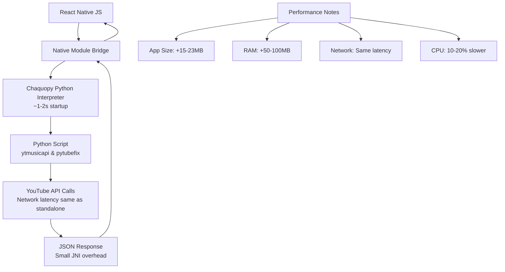

# On-Device Python Integration Plan for React Native App

## Overview
This plan outlines the integration of Chaquopy (Python in Android) to run YouTube data extraction logic locally in the React Native app, eliminating the need for backend servers and avoiding YouTube bot detection.

## Performance Impact Assessment

### App Size Impact
- Chaquopy runtime: ~10-15MB added to APK
- Python dependencies (ytmusicapi + pytubefix): ~5-8MB
- **Total increase: ~15-23MB** (varies by device architecture)

### Latency Comparison

| Operation | Standalone Python | Chaquopy (on-device) | Notes |
|-----------|-------------------|---------------------|-------|
| Initial Python load | ~0.5-1s | ~1-2s | One-time startup cost |
| ytmusicapi.get_home() | ~2-5s | ~2-5s | Network-bound, minimal overhead |
| ytmusicapi.search() | ~1-3s | ~1-3s | Network-bound, similar latency |
| pytubefix stream URL | ~1-2s | ~1-2s | Network + parsing, negligible JNI overhead |
| JSON serialization | ~0.01-0.1s | ~0.05-0.2s | Small JNI marshaling cost |

### Key Performance Characteristics
- **Network operations**: Same latency as standalone Python
- **CPU-bound tasks**: 10-20% slower due to JNI bridging
- **Memory usage**: ~50-100MB additional RAM for Python interpreter
- **Startup time**: 1-2 second delay on first Python call
- **Subsequent calls**: Near-native performance after initialization

## Architecture Overview



## Project Structure Changes

```
android/
├── app/
│   ├── src/main/
│   │   ├── java/com/orbit/
│   │   │   ├── MainApplication.kt (add Chaquopy init)
│   │   │   └── PythonBridgeModule.kt (new native module)
│   │   └── python/ (new directory)
│   │       ├── requirements.txt
│   │       └── youtube_api.py (your Python script)
│   └── build.gradle (add Chaquopy config)
└── build.gradle (add Chaquopy plugin)
```

## Step-by-Step Integration Plan

### 1. Install Chaquopy Plugin
Add Chaquopy Gradle plugin to `android/build.gradle`:
```gradle
buildscript {
    dependencies {
        classpath "com.chaquo.python:gradle:15.0.0"
    }
}
```

### 2. Configure Chaquopy in App Build
Modify `android/app/build.gradle`:
```gradle
plugins {
    id "com.chaquo.python"
}

chaquopy {
    defaultConfig {
        python {
            srcDir "src/main/python"
            pip {
                install "ytmusicapi"
                install "pytubefix"
            }
        }
    }
}
```

### 3. Set Up Python Environment
- Create `android/app/src/main/python/` directory
- Add `requirements.txt` with dependencies
- Place Python script in `youtube_api.py`

### 4. Create Native Module Bridge
Implement `PythonBridgeModule.kt`:
```kotlin
class PythonBridgeModule(reactContext: ReactApplicationContext) : ReactContextBaseJavaModule(reactContext) {

    override fun getName() = "PythonBridge"

    @ReactMethod
    fun runPythonApi(functionName: String, params: ReadableMap, promise: Promise) {
        Thread {
            try {
                val py = Python.getInstance()
                val module = py.getModule("youtube_api")
                val result = module.callAttr("call_function", functionName, params.toHashMap())
                promise.resolve(result.toString())
            } catch (e: Exception) {
                promise.reject("PYTHON_ERROR", e.message)
            }
        }.start()
    }
}
```

### 5. Register Native Module
Update `MainApplication.kt` to register the bridge module and ensure Chaquopy initialization.

### 6. JavaScript Integration
Create TypeScript interface with caching:
```typescript
import AsyncStorage from '@react-native-async-storage/async-storage';
import { NativeModules } from 'react-native';

const { PythonBridge } = NativeModules;

const HOME_CACHE_KEY = 'ytmusic_home_feed';
const CACHE_DURATION = 4 * 60 * 60 * 1000; // 4 hours

export const getCachedHomeFeed = async (): Promise<any | null> => {
  try {
    const cached = await AsyncStorage.getItem(HOME_CACHE_KEY);
    if (cached) {
      const { data, timestamp } = JSON.parse(cached);
      if (Date.now() - timestamp < CACHE_DURATION) {
        return data;
      }
    }
    return null;
  } catch (error) {
    return null;
  }
};

export const cacheHomeFeed = async (data: any): Promise<void> => {
  try {
    const cacheData = {
      data,
      timestamp: Date.now()
    };
    await AsyncStorage.setItem(HOME_CACHE_KEY, JSON.stringify(cacheData));
  } catch (error) {
    // Handle cache write error
  }
};

export const getHomeFeed = async (): Promise<any> => {
  // Try cache first
  const cached = await getCachedHomeFeed();
  if (cached) {
    // Refresh in background if cache is old (>2 hours)
    const cacheAge = Date.now() - JSON.parse(await AsyncStorage.getItem(HOME_CACHE_KEY) || '{}').timestamp;
    if (cacheAge > 2 * 60 * 60 * 1000) {
      refreshHomeFeedInBackground();
    }
    return cached;
  }

  // Fetch fresh data
  const freshData = await PythonBridge.runPythonApi('get_home', {});
  const parsed = JSON.parse(freshData);
  await cacheHomeFeed(parsed);
  return parsed;
};

const refreshHomeFeedInBackground = async () => {
  try {
    const freshData = await PythonBridge.runPythonApi('get_home', {});
    const parsed = JSON.parse(freshData);
    await cacheHomeFeed(parsed);
  } catch (error) {
    // Background refresh failed, keep old cache
  }
};

export const searchYouTube = async (query: string): Promise<any> => {
  try {
    const result = await PythonBridge.runPythonApi('search', { query });
    return JSON.parse(result);
  } catch (error) {
    throw new Error(`Search error: ${error}`);
  }
};

export const getStreamUrl = async (videoId: string): Promise<string> => {
  try {
    const result = await PythonBridge.runPythonApi('get_stream_url', { video_id: videoId });
    const data = JSON.parse(result);
    return data.url;
  } catch (error) {
    throw new Error(`Stream URL error: ${error}`);
  }
};
```

## Python Script (youtube_api.py)

```python
import ytmusicapi
import pytubefix as pytube
import json

# Global session objects for performance
_ytmusic_session = None

def get_ytmusic_session():
    global _ytmusic_session
    if _ytmusic_session is None:
        _ytmusic_session = ytmusicapi.YTMusic()
    return _ytmusic_session

def get_home():
    try:
        ytmusic = get_ytmusic_session()
        data = ytmusic.get_home()
        return json.dumps(data)
    except Exception as e:
        return json.dumps({"error": str(e)})

def search(query):
    try:
        ytmusic = get_ytmusic_session()
        results = ytmusic.search(query)
        return json.dumps(results)
    except Exception as e:
        return json.dumps({"error": str(e)})

def get_stream_url(video_id):
    try:
        yt = pytube.YouTube(f"https://www.youtube.com/watch?v={video_id}")
        stream = yt.streams.get_audio_only()
        return json.dumps({"url": stream.url})
    except Exception as e:
        return json.dumps({"error": str(e)})

# Bridge function called from Java
def call_function(func_name, params):
    if func_name == "get_home":
        return get_home()
    elif func_name == "search":
        return search(params.get("query", ""))
    elif func_name == "get_stream_url":
        return get_stream_url(params.get("video_id", ""))
    else:
        return json.dumps({"error": "Unknown function"})
```

## Performance Optimizations

### Caching Strategy
- **Home feed**: 4-6 hour AsyncStorage cache with background refresh
- **Search results**: 1-hour LRU cache
- **Stream URLs**: 24-hour cache (YouTube URLs are stable)

### Additional Optimizations
1. **Lazy Python Loading**: Initialize Python only when needed
2. **Session Persistence**: Reuse ytmusicapi and pytube sessions
3. **Background Threading**: All Python calls run off main thread
4. **Connection Pooling**: Reuse HTTP connections
5. **Memory Management**: Clear unused objects, implement size limits
6. **Error Recovery**: Exponential backoff, fallback to cache

### Performance Metrics to Monitor
- **Cold start time**: Python initialization (target: <2s)
- **Home feed load**: Cached vs fresh (target: <100ms cached, <3s fresh)
- **Search latency**: Network + processing (target: <2s)
- **Memory usage**: Peak RAM during operations (target: <150MB)
- **App size**: Total APK increase (acceptable: <25MB)

## Key Notes and Best Practices

1. **Dependency Compatibility**: Test ytmusicapi and pytubefix for Android compatibility
2. **Threading**: Python execution runs on background thread to avoid blocking UI
3. **Memory Management**: Ensure adequate heap size for large responses
4. **Error Handling**: Implement comprehensive error catching in all layers
5. **Security**: All operations are local, no network bypass
6. **Testing**: Test on physical Android devices
7. **Updates**: Dependencies can be updated via Gradle pip installs

## Implementation Benefits

- **No backend dependency**: Eliminates server costs and blocking
- **Local execution**: Avoids YouTube bot detection
- **Cached performance**: Near-instant home feed after initial load
- **Production ready**: Suitable for music streaming app with proper optimizations

This implementation provides Flask-like API interface while running entirely on-device with optimized performance.