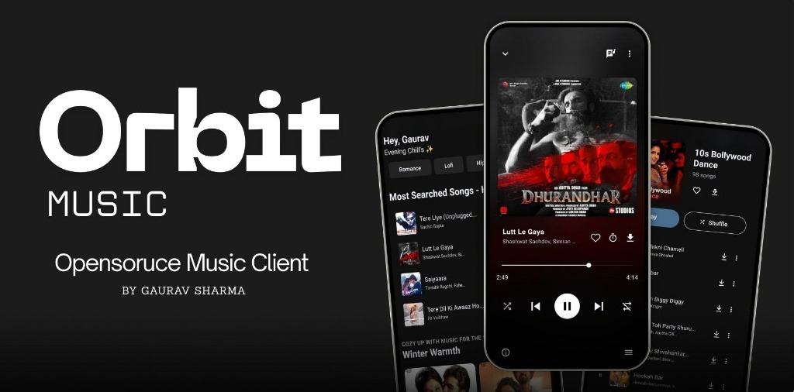

<p align="center">
  
</p>

<p align="center">
  <a href="https://github.com/gauravxdev/Orbit/issues"><strong>Report Bug</strong></a>
  ·
  <a href="https://github.com/gauravxdev/Orbit/issues"><strong>Request Feature</strong></a>
</p>

<p align="center">
  <b>⚠️ DISCLAIMER: This project is ONLY for educational purposes ⚠️</b><br>
  This application serves as a demonstration of modern mobile development techniques and API integration.
</p>


## ✨ What is Orbit?

In a world of subscription tiers and ad-heavy interfaces, **Orbit** was born from a simple idea: music should be about the artist and the listener, nothing else. Orbit is a premium-feel, open-source music player that bridges the gap between your local library and the vast universe of online streaming. 

Built with React Native, it’s designed to be fast, fluid, and focused on providing a high-fidelity listening experience without the typical industry "noise."

## 🚀 Latest Power Features

We've been busy! Orbit has evolved from a simple player into a sophisticated audio engine. Here’s what’s new:

- **🧠 Smart Continuous Prefetching** — Our prefetch engine predicts your next move. It automatically buffers the next two tracks (N+1 and N+2) in the background, ensuring that "Next" button click is always instant and gapless.
- **🎙️ Podcast Universe** — A brand-new, dedicated podcast engine powered by PodcastIndex. Discover, stream, and manage your favorite shows right alongside your music.
- **� Robust Offline Mode** — Take your music anywhere. Download high-quality tracks directly to your device for uninterrupted offline listening, with a dedicated download manager for batch actions.
- **💎 Hi-Fi & FLAC Support** — For the audiophiles. Orbit supports a wide range of formats, including **FLAC**, seeking out the highest quality streams available to satisfy your ears.
- **📊 Technical Transparency** — Know exactly what you're hearing. Orbit now displays real-time streaming quality, including bitrates and codecs (like **Opus 148kbps**, **AAC 320kbps**, or **FLAC**), so you’re never in the dark about your audio fidelity.
- **🌊 Fluid UI & Gestures** — Experience buttery-smooth 60fps animations powered by Reanimated. From the interactive player drawer to the shimmer-effect skeleton loaders and the customized sleep timer, every interaction feels alive.
- **📂 Unified Library** — Seamlessly blend your local MP3s and FLACs with JioSaavn's massive library. One search, one queue, all your music.

## 🛠️ Built With

Orbit leverages a modern, high-performance stack:

- **React Native** - For a truly native feel across platforms.
- **RN Track Player** - The industry standard for robust background audio.
- **Reanimated & Gesture Handler** - For that premium, high-response UI.
- **JioSaavn API & PodcastIndex** - Our windows to a world of content.
- **Redux & Context** - Ensuring your queue and settings are always in sync.

## 🏁 Getting Started

Ready to take Orbit for a spin?

### Prerequisites
- Node.js 18+
- React Native environment (Android SDK / Xcode)
- A passion for good music.

### Quick Start
1. **Clone the repository**
   ```bash
   git clone https://github.com/gauravxdev/Orbit.git
   cd Orbit
   ```
2. **Install dependencies**
   ```bash
   npm install
   ```
3. **Launch the Engine**
   ```bash
   # For Android
   npx react-native run-android

   # For iOS
   cd ios && pod install && cd ..
   npx react-native run-ios
   ```

## 🗺️ Roadmap: The Orbit Journey

- [x] **Smart Prefetching Engine** (Completed)
- [x] **Podcast Integration** (Completed)
- [x] **Technical Quality Display** (Completed)
- [x] **Enhanced Offline Downloads** (Completed)
- [ ] **Collaborative Playlists**
- [ ] **Lyrics Synchronization 2.0**

## 🤝 Join the Community

We’re more than just code. We’re a community of music lovers.

<p align="center">
  <a href="https://t.me/OrbitMusicOfficial">
    
  </a>
  &nbsp;&nbsp;
  <a href="https://discord.gg/JrMzKes3">
    
  </a>
</p>

Have an idea? [Open an issue](https://github.com/gauravxdev/Orbit/issues) or drop by our Telegram and Discord!

## 📜 License & Legal

Orbit is open-source under the **MIT License**. 

**IMPORTANT**: Orbit does not host any media files. All streaming content is sourced via third-party APIs. Users are responsible for ensuring they comply with local laws and the terms of service of any third-party providers.

### ⚖️ Disclaimer
Orbit is a client-side application developed strictly for **educational purposes**. We do not host any links, files, or media on our own servers. The app simply provides an interface to access open-source and freely available resources already present on the internet. 

This project and its contents are not affiliated with, funded, authorized, endorsed by, or in any way associated with **YouTube**, **Google LLC**, **JioSaavn**, **PodcastIndex**, or any of their affiliates and subsidiaries. 

Any trademark, service mark, trade name, or other intellectual property rights used in this project are owned by the respective owners. Support for high-fidelity formats like **FLAC** is provided for playback of user-owned assets and does not imply any rights to non-licensed content.

**Notice to Copyright Holders**: If you are the owner of any content accessible through this app and have concerns, we kindly ask that you do not take legal action immediately. Please contact us directly via our community channels or by opening a GitHub issue. We respect intellectual property rights and will promptly remove any infringing content or links upon valid request.

## 💖 Credits & Acknowledgments

**Orbit** is a derivative work based on **[Melody](https://github.com/Infinite-Null/Melody)** by **Ankit Kumar Shah**. We thank the original author and contributors of Melody for their foundational work that made this project possible.

Additional acknowledgments:
- **[ArchiveTune](https://github.com/ArchiveTune/ArchiveTune)** & **[OuterTune](https://github.com/vfsfitvnm/OuterTune)** — For the UI design inspiration and their sophisticated approach to YouTube Music integration.


---
<p align="center">
  Created with ❤️ by <a href="https://github.com/gauravxdev"><strong>Gaurav Sharma</strong></a>
</p>
